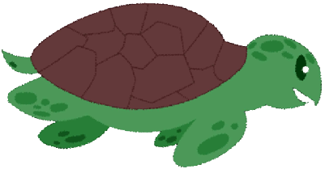

<h1 align="center">Emily's Journey</h1>

  

  Help Emily get her eggs to the beach for sea turtle nesting season while avoiding pollution in the ocean.

## 🚀 Quick start

Emily's Journey is a web-based game, so there is no installation required. Simply git clone it to your terminal to play the game:

git clone https://github.com/BryanOrih/Mod-1-The-Game.git

## 🎮 How to Play

The objective of the game is to help Emily get her eggs to the beach by navigating through the ocean while avoiding pollution.

To move Emily, use the arrow keys on your keyboard. Your objective is to get her eggs to the beach while avoiding the random trash moving at random speeds. 
Once you have reached the beach, the game will end and emily will thank you for all your hard work.

## 🤝 Contributing

Contributions to Emily's Journey are welcome! If you find a bug or have a suggestion for a new feature, please open an issue or submit a pull request.

## 📄 License

Emily's Journey is released under the [MIT License](https://opensource.org/licenses/MIT).
